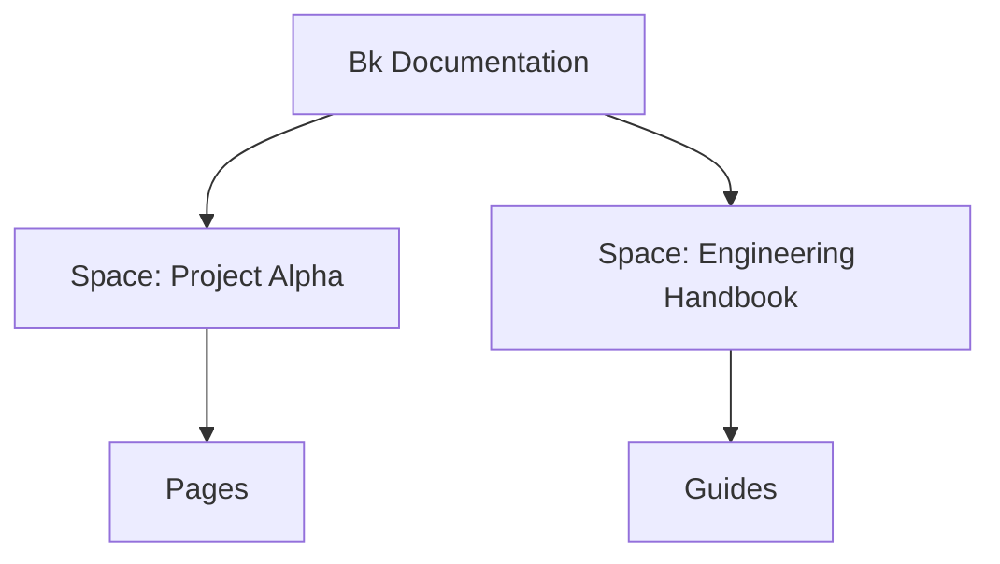

## Overview

Bk Documentation organizes your project knowledge into structured spaces. You create spaces to group related documentation, build pages with hierarchies, manage versions, and collaborate with teams. These core concepts help you navigate and extend your documentation effectively.

<Columns cols={3}>
  <Card title="Spaces" icon="database" href="/docs/spaces">
    Container for all your docs.
  </Card>
  <Card title="Pages" icon="book-open" href="/docs/pages">
    Building blocks of content.
  </Card>
  <Card title="Versions" icon="git-branch" href="/docs/versions">
    Track changes over time.
  </Card>
</Columns>

## Documentation Spaces

Spaces act as top-level containers for your documentation. You create a space for each project or team, such as `project-alpha-docs` or `engineering-handbook`. Each space holds pages, supports versioning, and enables permissions.

<Callout kind="tip">
  Use descriptive names for spaces, like `{project}-{team}-docs`, to keep organization clear.
</Callout>

Spaces support nested structures but maintain flat access for search.



## Page Types and Hierarchies

Pages form the content hierarchy within spaces. You organize them into trees for navigation.

<Tabs>
  <Tab title="Standard Pages" icon="file-text">
    Use for general content like guides and references.
    
    Create hierarchies with parent-child relationships.
  </Tab>
  <Tab title="API Pages" icon="code">
    Specialized for endpoints with `<ParamField>` and `<Response>` components.
    
    Example structure:
    
    ```
    /api/
    ├── users.mdx
    └── posts.mdx
    ```
  </Tab>
  <Tab title="Changelogs" icon="git-commit">
    Track releases using `<Update>` components.
    
    Maintain one per space or major version.
  </Tab>
</Tabs>

## Version Control Basics

Bk integrates with Git for version control. You commit changes, create branches, and merge updates directly from the editor.

<CodeGroup tabs="CLI,Web">
  ```bash
  # Clone your space repo
  git clone https://git.bkdocs.com/project-alpha-docs.git
  
  # Make changes and commit
  git add .
  git commit -m "Add authentication guide"
  git push origin main
  ```
  ```typescript
  // Web UI equivalent
  // 1. Edit page in browser
  // 2. Click "Commit Changes"
  // 3. Select branch: main or new-feature
  ```
</CodeGroup>

<Expandable title="Advanced Git Workflow" default-open="false">
  Branch per feature:
  
  | Step | Command | Purpose |
  |------|---------|---------|
  | 1 | `git checkout -b feature/login` | Create branch |
  | 2 | Edit pages | Add content |
  | 3 | `git push origin feature/login` | Push for review |
  | 4 | Merge via PR | Integrate changes |
</Expandable>

## Collaboration Workflows

Follow these steps to collaborate effectively.

<Steps>
  <Step title="Invite Collaborators" icon="users">
    In space settings, add users by email or team.
    
    Set roles: Admin, Editor, Viewer.
  </Step>
  <Step title="Review Changes" icon="git-pull-request">
    Use pull requests for major updates.
    
    Comment inline on pages.
  </Step>
  <Step title="Publish Versions" icon="git-branch">
    Tag releases like `v1.2.0`.
    
    Promote to production space.
  </Step>
</Steps>

<Callout kind="info">
  Enable notifications in space settings to stay updated on changes.
</Callout>

These concepts form the foundation. Build spaces, structure pages, version content, and collaborate to scale your documentation.