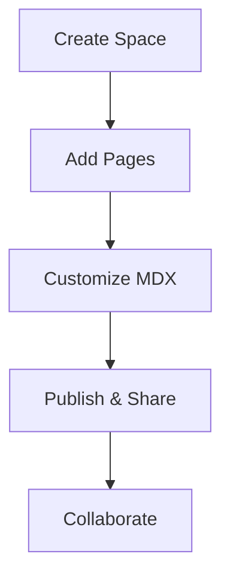

## Overview

Bk Documentation provides a centralized platform where you organize and manage all your project documentation. Create dedicated spaces for teams, products, or initiatives. Customize layouts with MDX components for rich, interactive guides that enhance user experience.

You access version control, search, and collaboration tools directly within your docs. Start by creating a new space or importing existing Markdown files.

<Callout kind="info">
  Bk Documentation supports real-time editing and previews, ensuring your content stays up-to-date.
</Callout>

## Key Features

Discover the core capabilities that make Bk Documentation powerful for technical teams.

<Columns cols={3}>
  <Card title="Custom Spaces" icon="folder" href="/docs/spaces">
    Organize docs into isolated spaces for different projects or teams.
  </Card>
  <Card title="MDX Components" icon="components" href="/docs/components">
    Build interactive pages with Steps, Tabs, Cards, and more.
  </Card>
  <Card title="Version History" icon="git-branch" href="/docs/versions">
    Track changes with Git-like versioning and rollback features.
  </Card>
</Columns>

## Getting Started

Follow these steps to set up your first documentation space.

<Steps>
  <Step title="Create a Space" icon="plus">
    Navigate to the dashboard and click "New Space". Enter a name like "API Docs" and select your team.
  </Step>
  <Step title="Add Content" icon="file-text">
    Upload Markdown files or create new pages. Use the editor to add MDX components.
  </Step>
  <Step title="Publish" icon="globe">
    Preview changes, then publish. Share the public URL with your users.
  </Step>
</Steps>

## Interface Orientation

Explore the main sections of the Bk Documentation interface.

<Tabs>
  <Tab title="Dashboard" icon="layout">
    View all your spaces, recent edits, and analytics at a glance.

    - Spaces list with search
    - Quick actions for new pages
    - Activity feed
  </Tab>
  <Tab title="Editor" icon="edit-3">
    Compose rich docs with live preview.

    ```mdx
    ## Your Heading

    Use <Callout kind="tip">components</Callout> for emphasis.
    ```
  </Tab>
  <Tab title="Settings" icon="settings">
    Configure branding, permissions, and integrations.

    | Option       | Description                  |
    |--------------|------------------------------|
    | Brand Color  | Set primary color like `#3B82F6` |
    | Permissions  | Role-based access control    |
    | Integrations | Connect to GitHub or Slack   |
  </Tab>
</Tabs>

## Brand Guidelines

Maintain consistency across your documentation with these guidelines.

Use the brand color `#3B82F6` for accents. Define it in your theme configuration.

<CodeGroup tabs="CSS, Tailwind">
  ```css
  :root {
    --brand-color: #3B82F6;
  }

  .accent {
    color: var(--brand-color);
  }
  ```
  ```javascript
  module.exports = {
    theme: {
      extend: {
        colors: {
          brand: '#3B82F6',
        },
      },
    },
  }
  ```
</CodeGroup>

<Expandable title="Advanced Customization" default-open="false">
  For custom icons or fonts, edit the `config.json` file:

  ```json
  {
    "brandColor": "#3B82F6",
    "fontFamily": "Inter, sans-serif"
  }
  ```

  Integrate with your CI/CD pipeline for automated deployments.
</Expandable>



This setup ensures your documentation remains professional and on-brand. Explore the linked pages for deeper dives into each feature.